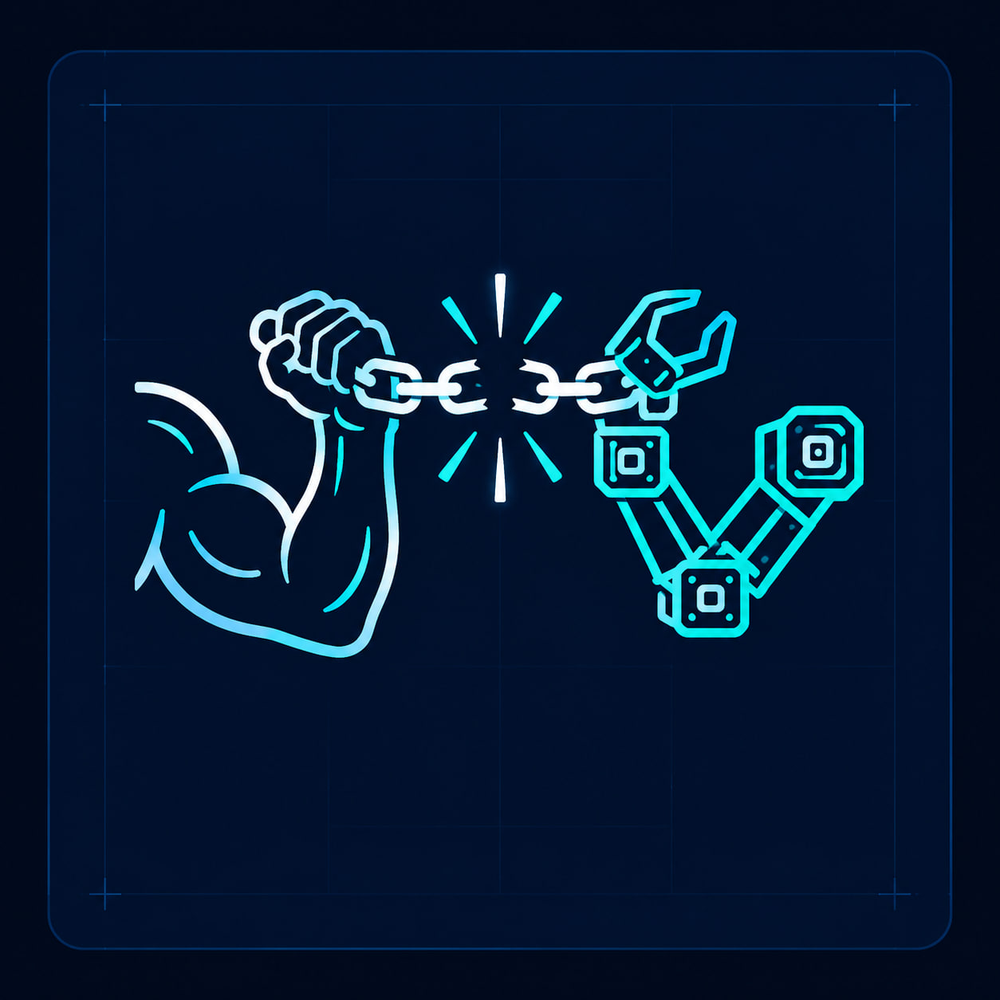
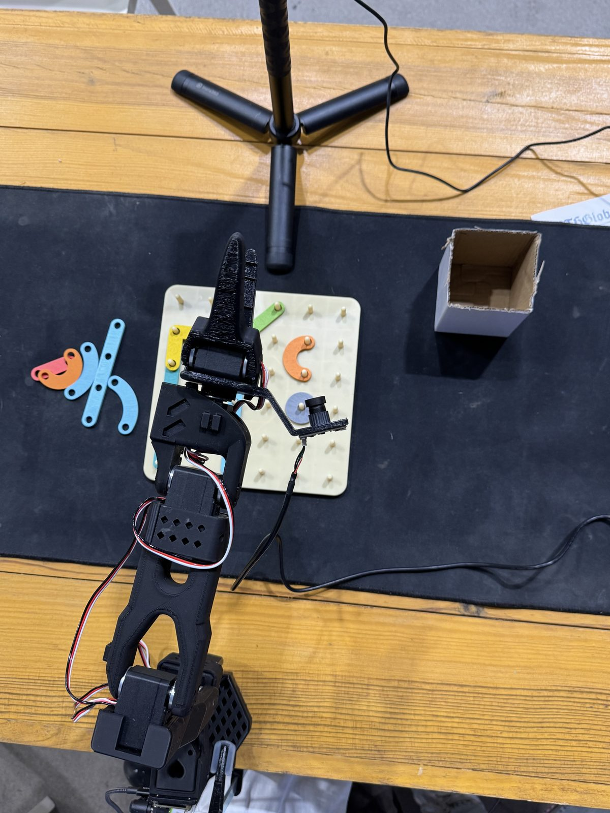
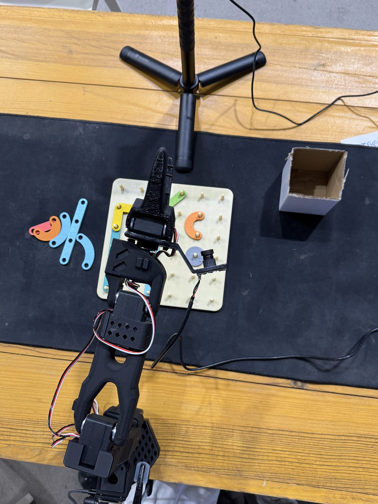
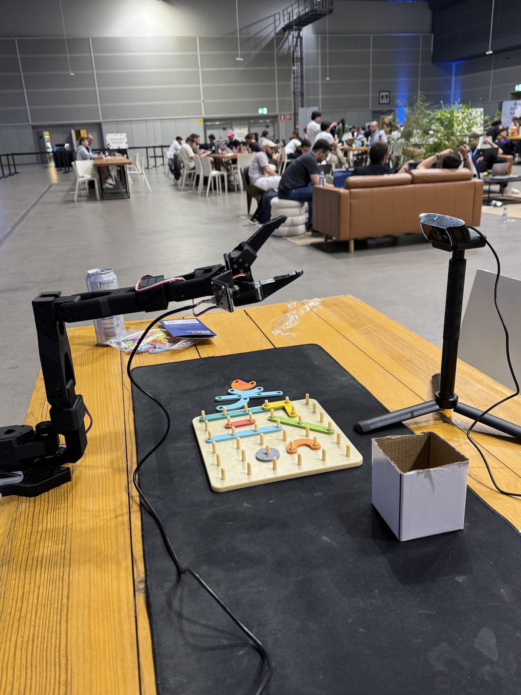

<p align="center">
  
</p>

<h1 align="center">Hands Unchained</h1>

<p align="center">
  <a href="https://web-production-b5106.up.railway.app"><b>▶&nbsp; Drive a real robot arm →</b></a>
</p>

<p align="center">
  <sub>live hub · nothing to install · watching needs no wallet</sub>
</p>

**ETHGlobal Lisbon 2026.** Crowdsourced robot teleoperation: real SO-101 arms
and MuJoCo sims register as **rigs** on a cloud hub; operators browse a lobby
and drive them over the public internet — browser keyboard or their **own
leader arm** — with a single-writer lease, bystander e-stop, and a 0.5 s
network deadman. Plain HTTP end to end: curl-debuggable, no WebRTC, no SDKs.

## The rig, on the floor at Lisbon

<p align="center">
  
  
  
</p>

Not a render: this is the actual follower arm, the peg board it picks from, the
overhead camera that feeds the MJPEG stream, and the venue it ran in. Anyone
with [the lobby URL](https://web-production-b5106.up.railway.app) could drive
this arm from anywhere in the world.

```
                   ┌──────────────────────────┐
   browser ───────▶│  HUB (Railway)           │  lobby · drive UI · relay
   (operator)      │  in-memory rig registry  │  lease · verb table
                   └───────────▲──────────────┘
                      outbound │ HTTP only (50ms control / 8fps MJPEG)
            ┌──────────────────┴───────────────────┐
            │ RIG AGENT (any Mac)                   │  headless; dials OUT —
            │ apps/web src/agent.ts + apps/driver   │  no ports, no NAT config
            │ → MuJoCo sim  OR  real SO-101 arm     │
            └───────────────────────────────────────┘
   controller.py ── your leader arm ──▶ hub ──▶ any rig   (leader-over-wire)
```

## What it looks like

**The lobby.** Every rig that has dialled in, with a live preview. A real SO-101
and a MuJoCo sim, both bookable for thirty minutes — the page cannot tell them
apart and neither can the driving code.


**Getting access.** The drive page asks for exactly what is missing and nothing
else, one step at a time — prove you're a unique human, then put money on it.
The chain is a currency choice, not a product one: same contract, same escrow,
same three strikes either way.


**Driving.** The clock runs, the stake is down, and every episode is graded on
its own by a referee in a TEE — the verdict lands about a minute later.


**The operator's side, on a Vision Pro.** The native visionOS leader
(`apps/avp-client`) through the operator's own eyes: the virtual leader arm
floats next to the real bench, pinch-and-drag poses it, and the rig's camera
feeds ride along in the panel. No Mac gateway, no serial cable — the headset
talks straight to the hub.


## Layout

- `apps/web` — one TypeScript app (TanStack Start + Effect v4, Bun), two
  entries: **the hub** (`src/server.ts`, the deployed web app — lobby, drive,
  datasets, trainings, tasks/attempts) and **the agent**
  (`src/agent.ts`, a headless rig). Every owner action reaches the rig over
  the hub's verb pipe — nothing runs locally but the agent.
- `apps/driver` — Python (uv, pinned `lerobot==0.6.0`): real-arm serial +
  MuJoCo sim backends, teleop sources (keys/leader/phone/remote/scripted),
  `controller.py` (drive a remote rig with your leader arm). Sim model and
  IK URDF are vendored — the repo is self-contained.
- `apps/avp-client` — native visionOS direct-hub leader for Vision Pro. It
  uses the browser-held hub lease, needs no Mac gateway or serial connection,
  and renders the selected rig's first two camera feeds.
- `docs/ — [SPEC](docs/SPEC.md) (architecture) · [TESTING](docs/TESTING.md)
  (checklists) · [UX](docs/UX.md) · [friend-setup](docs/friend-setup.md)
  (put your arm on the hub in 5 steps).

## Quickstart

```sh
bun install
cd apps/driver && uv sync && cd ../..     # python driver (macOS, python 3.12)

# loopback rehearsal of production (two tabs):
bun run hub                                # hub → :3001
bun run rig:sim                            # headless sim rig (no port), autoconnects
# open http://localhost:3001 → Drive with keyboard → WASD/QE
```

Register a rig with **the deployed hub —
<https://web-production-b5106.up.railway.app>** (zero config: that URL is the
baked-in default, follower port auto-detected, rig named after your hostname).
Your arm appears in that lobby, for anyone, within about a second:

```sh
cd apps/web
LAB_AUTOCONNECT=real bun run agent
# headless: no UI, no listening port — the rig only dials out.
# The terminal prints your RIG OWNER KEY — you need it to define tasks.
```

## Tasks — the point of all this

The rig owner defines a task on the drive page ("push the cube into the
corner"); operators who take the rig attempt it. **Each successful attempt
is one labeled lerobot episode** (the task title is the per-frame label) in
the task's dataset — crowdsourced training data with per-episode operator
provenance (`.data/attempts.json` on the rig).

The task the arm in those photos is set for: move the coloured pieces on the peg
board. The wrist camera rides on the gripper, so every episode carries both the
workspace view and the close one.

```
owner: task_upsert (owner key) ──▶ task card in lobby + drive
operator: pick how to drive (keyboard / their leader) → Start attempt → do the task
        → ✓ Success (episode saved)  /  ✗ Discard (buffer dropped)
dataset: grows episode by episode, labeled, on the rig owner's machine
```

Drive a rig with your own leader arm (also zero config — port auto-detected,
registers under your hostname; then click "Drive with your leader" on any
rig's drive page):

```sh
bun run teleop
# already driving a rig? Stop teleop on its page first — the driver refuses a
# second session, so the remote source would never start.
```

## The market — verified humans, graded work, real payment

`MARKET_MODE=1` turns the platform into a labor market. The loop above has
one honest hole: **success is self-declared** — the operator clicks ✓ and the
episode counts. The moment strangers get *paid* for this, that hole (and two
others) must close, one per sponsor:

| Hole | Fix |
|---|---|
| Operator identity is a random per-tab `clientId` — sybils get execution rights on physical hardware | **World ID** gates the slot. Unverified → **HTTP 402**, arm stays locked. |
| The worker grades their own paid work | **0G Compute** is the referee: a TEE-attested model judges the recorded episode, and its verdict — not the operator — decides payment. |
| Anyone could take the arm out from under you mid-episode | **`SlotMarket` on 0G**: booking IS staking. Thirty exclusive minutes, a key only you know, and a FIFO queue — all on chain. |

```
verify (World ID, 18+ & live)    →  session
  ↓ book 30 min · 0.05 OG          THEIR wallet → SlotMarket   (MetaMask, one signature, ever)
  ↓ type your key                  hub relays startSlot — THE CLOCK STARTS HERE, not at booking
lease granted · drive · attempt · claim ✓/✗
  ↓ the recorded episode itself (observation.state @30fps — the work product)
0G Compute referee  →  {score, pass, teeVerified}
  ↓ pass                           +0.05 OG credited from the reward pool
  ↓ fail after claiming success    ⚠ strike — three and the whole stake is slashed
slot ends  →  control revoked · settle() pays stake + credits, permissionless
anchor: 0G Storage root · EpisodeRegistry event · the verdict itself on SlotMarket
```

**The contract checks 0G's enclave signature itself.** `recordEpisode` rebuilds
the EIP-191 text the TEE signed and `ecrecover`s it against the signer address
0G's own registry publishes — so the hub can choose *which* verdict to submit
and can never *forge* one. A grade with no attestation (0G unreachable, hub fell
back to local heuristics) can still pay you but can never cost you a strike:
without the enclave, the market may be lenient, never punitive.

Nobody profits from a slash. A voided stake goes back into the **reward pool**,
not to a treasury — the settler is the one component you are asked to trust, and
it must not also earn from voiding people.

The operator holds their own keys — they stake from MetaMask and are paid
back to the same address; the hub never derives or holds an operator key.
Every payment is submitted by the settlement worker on the referee's
verdict, with no human clicking pay.

**The two chains share a cryptographic link, not our word for it.** 0G's
broker signs each inference response inside the enclave with plain EIP-191,
so [`contracts/TeeAttestation.sol`](contracts/TeeAttestation.sol) — deployed
on **Hedera** — re-derives the digest and `ecrecover`s it against the signer
address 0G's own registry publishes on Galileo. Our backend carries the
bytes across and cannot forge them; feed the contract a tampered response
and it reverts. The single cross-chain assumption is that pinned signer
address, which the deploy script reads live from 0G rather than hardcoding.

Stated plainly, because it matters: this proves the grading output came out
of 0G's TEE. It does **not** prove what was asked (0G signs a hash of the
broker-rewritten request, which can't be reproduced off-chain), and our
backend still chooses which graded attempt to submit.

**Per-sponsor detail:** [WORLD](docs/market/WORLD.md) (gate + Identity Check
testing docs) · [HEDERA](docs/market/HEDERA.md) (payment flow mechanics) ·
[0G](docs/market/0G.md) (proof of inference + contract).

Live testnet artifacts:

| What | Where |
|---|---|
| **SlotMarket** (0G Galileo, 16602) — signer read LIVE from 0G's registry | [`0x0EeFee711Ed37dE9C0d892638F9d14ac9047a9D8`](https://chainscan-galileo.0g.ai/address/0x0EeFee711Ed37dE9C0d892638F9d14ac9047a9D8) |
| **SlotMarket** (Hedera testnet, 296) — same contract, signer pinned | [`0x7f37B89DE964DFf7EE6EF6d2E3d58dAF42Ac6863`](https://hashscan.io/testnet/contract/0x7f37B89DE964DFf7EE6EF6d2E3d58dAF42Ac6863) |
| EpisodeRegistry (0G Galileo, 16602) | [`0x80669DE19A96F0004adbC3C81c528Ef1abB9a494`](https://chainscan-galileo.0g.ai/address/0x80669DE19A96F0004adbC3C81c528Ef1abB9a494) |
| HCS provenance topic (Hedera — dormant) | [`0.0.9746374`](https://hashscan.io/testnet/topic/0.0.9746374) |
| TeeAttestation (Hedera testnet — dormant) | [`0xE6ad861D1c18d2FeFe18b49bCa1B407587673CC3`](https://hashscan.io/testnet/contract/0xE6ad861D1c18d2FeFe18b49bCa1B407587673CC3) |
| Stake escrow (holds operator stakes) | [`0.0.9746375`](https://hashscan.io/testnet/account/0.0.9746375) |
| Example autonomous payout | [`0.0.9700388-1785002413-836244743`](https://hashscan.io/testnet/transaction/0.0.9700388-1785002413-836244743) |
| Example on-chain TEE verification | [`0xfeb0ea1d…acdbea`](https://hashscan.io/testnet/transaction/0xfeb0ea1d21629cf4b41336968ee7969b30a9d9c3c3fda577c8377e7659acdbea) |

Off by default: with `MARKET_MODE` unset the platform behaves exactly as the
sections above describe — no gate, no chain, no market.

## Safety model

15°/tick clamp on remote input · 0.5 s deadman (hold pose on silence) · servo
EEPROM limits from the rig OWNER's calibration are the hard stop · e-stop
works for anyone watching, lease or not · torque drops on disconnect.

## Deploy

Railway, config-as-code in `apps/web/railway.toml` (Dockerfile build from the
repo root, 1 replica + no sleep — the rig registry is in-memory by design).
Pushes to `main` deploy automatically.

## Provenance

Grown from [so101-lab](https://github.com/grmkris/so101-lab) — the imitation-
learning lab notebook for the same arm, where the ML track (datasets, ACT/
SmolVLA training, evals) continues to live.
